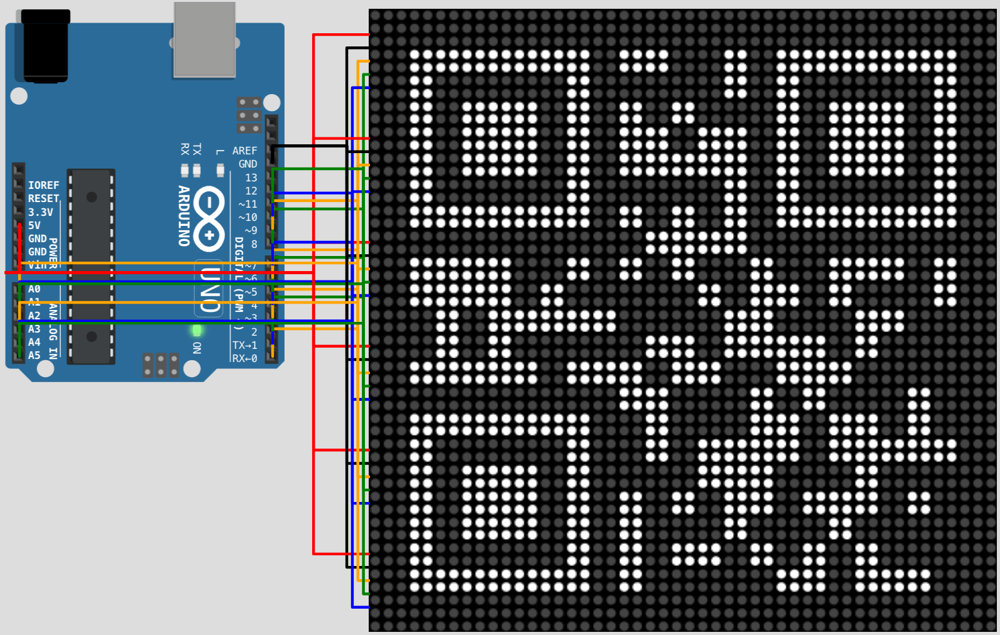
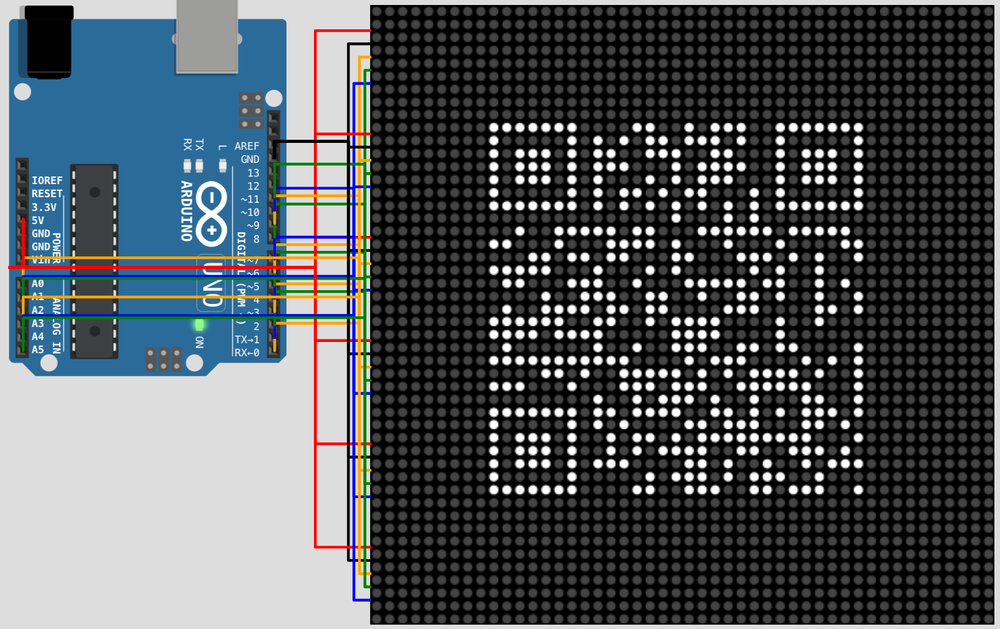

# Arduino QR Code

An Arduino QR code display using a matrix of 8×8 LED dot matrix displays driven
by the MAX7219 display driver.

[8×8 LED dot matrix displays AliExpress](https://www.aliexpress.com/item/32849877252.html)



The displays are chainable up to 8 displays in one chain. Multiple chains need
to be used to drive more displays.

Arduino has 14 digital pins and 6 analog pins which can be used as digital. It
can support up to 6 chains (3 SPI pins per chain: DIN, CLK and CS). That results
in the maximum display size of 48×48 dots (6×6 displays to keep the QR square).
This allows displaying QR codes of versions 1-7 or displaying a version 1 code
at twice the size.

| Version  | Pixels       | Displays | Dots         | Utilization      |
|----------|--------------|----------|--------------|------------------|
| QR 1     | 21×21 (441)  | 9 (3×3)  | 24×24 (576)  | 77 % (441/576)   |
| QR 1 @2x | 42×42 (1764) | 36 (6×6) | 48×48 (2304) | 76 % (1764/2304) |
| QR 2     | 25×25 (625)  | 16 (4×4) | 32×32 (1024) | 61 % (625/1024)  |
| QR 3     | 29×29 (841)  | 16 (4×4) | 32×32 (1024) | 82 % (841/1024)  |
| QR 4     | 33×33 (1089) | 25 (5×5) | 40×40 (1600) | 68 % (1089/1600) |
| QR 5     | 37×37 (1369) | 25 (5×5) | 40×40 (1600) | 85 % (1369/1600) |
| QR 6     | 41×41 (1681) | 36 (6×6) | 48×48 (2304) | 72 % (1681/2304) |
| QR 7     | 45×45 (2025) | 36 (6×6) | 48×48 (2304) | 87 % (2025/2304) |

[QR Code Storage (Wikipedia)](https://en.wikipedia.org/wiki/QR_code#Storage)

| Version | NH  | NQ  | NM  | NL  | ANH | ANQ | ANM | ANL |
|---------|-----|-----|-----|-----|-----|-----|-----|-----|
| QR 1    | 17  | 27  | 34  | 41  | 10  | 16  | 20  | 25  |
| QR 2    | 34  | 48  | 63  | 77  | 20  | 29  | 38  | 47  |
| QR 3    | 58  | 77  | 101 | 127 | 35  | 47  | 61  | 77  |
| QR 4    | 82  | 111 | 149 | 187 | 50  | 67  | 90  | 114 |
| QR 5    | 106 | 144 | 202 | 255 | 64  | 87  | 122 | 154 |
| QR 6    | 139 | 178 | 255 | 322 | 84  | 108 | 154 | 195 |
| QR 7    | 154 | 207 | 293 | 370 | 93  | 125 | 178 | 224 |

N = numeric, AN = alpha-numeric, H = high, Q = quartile, M = medium, L = low

[Information Capacity (QRCode.com)](https://www.qrcode.com/en/about/version.html)

## [Wokwi Simulation](https://wokwi.com/arduino/projects/297148152803230218)

`qrcode.ino`
```ino
#include <LedControl.h>
#include "qrcode.h" // https://github.com/ricmoo/QRCode

int size = 6;
int side = size * 8;
QRCode qrcode;

// DIN, CLK, CS
LedControl ledControls[] = {
  LedControl(0, 1, 2, size),
  LedControl(3, 4, 5, size),
  LedControl(6, 7, 8, size),
  LedControl(9, 10, 11, size),
  LedControl(A0, A1, A2, size),
  LedControl(A3, A4, A5, size),
};

int main() {
  for (int index = 0; index < size; index++) {
    ledControls[index].setIntensity(0, 15);
  }

  int version = 1;
  uint8_t qrcodeData[qrcode_getBufferSize(version)];
  qrcode_initText(&qrcode, qrcodeData, version, ECC_LOW, "HTTPS://HUBELBAUER.NET");

  int scale = 2;
  int shift = (side - (qrcode.size * scale)) / 2;
  for (int y = shift; y < side; y++) {
    for (int x = shift; x < side; x++) {
      int address = size - 1 - (x / 8);
      int row = y % 8;
      int column = 7 - (x % 8);
      bool state = qrcode_getModule(&qrcode, (x - shift) / scale, (y - shift) / scale);
      if (x >= shift + (qrcode.size * scale) || y >= shift + (qrcode.size * scale)) {
        state = false;
      }

      int index = y / 8;
      ledControls[index].shutdown(address, false);
      ledControls[index].setLed(address, row, column, state);
      ledControls[index].shutdown(address, true);
    }
  }
}
```

`diagram.json`
```json
{
  "version": 1,
  "author": "Tomas Hubelbauer",
  "editor": "wokwi",
  "serialMonitor": {
    "display": "never"
  },
  "parts": [
    { "type": "wokwi-arduino-uno", "id": "u", "top": 30, "left": 0, "rotate": 90 },
    { "type": "wokwi-max7219-matrix", "id": "1", "top": 0, "left": 260, "attrs": { "chain": "6", "color": "white" } },
    { "type": "wokwi-max7219-matrix", "id": "2", "top": 75, "left": 260, "attrs": { "chain": "6", "color": "white" } },
    { "type": "wokwi-max7219-matrix", "id": "3", "top": 150, "left": 260, "attrs": { "chain": "6", "color": "white" } },
    { "type": "wokwi-max7219-matrix", "id": "4", "top": 225, "left": 260, "attrs": { "chain": "6", "color": "white" } },
    { "type": "wokwi-max7219-matrix", "id": "5", "top": 300, "left": 260, "attrs": { "chain": "6", "color": "white" } },
    { "type": "wokwi-max7219-matrix", "id": "6", "top": 375, "left": 260, "attrs": { "chain": "6", "color": "white" } }
  ],
  "connections": [
    [ "u:GND.1", "m1:GND", "black" ], [ "u:5V", "1:V+", "red" ], [ "u:0", "1:DIN", "orange" ], [ "u:1", "1:CLK", "blue" ], [ "u:2", "1:CS", "green" ],
    [ "u:GND.1", "m2:GND", "black" ], [ "u:5V", "2:V+", "red" ], [ "u:3", "2:DIN", "orange" ], [ "u:4", "2:CLK", "blue" ], [ "u:5", "2:CS", "green" ],
    [ "u:GND.1", "m3:GND", "black" ], [ "u:5V", "3:V+", "red" ], [ "u:6", "3:DIN", "orange" ], [ "u:7", "3:CLK", "blue" ], [ "u:8", "3:CS", "green" ],
    [ "u:GND.1", "m4:GND", "black" ], [ "u:5V", "4:V+", "red" ], [ "u:9", "4:DIN", "orange" ], [ "u:10", "4:CLK", "blue" ], [ "u:11", "4:CS", "green" ],
    [ "u:GND.1", "m5:GND", "black" ], [ "u:5V", "5:V+", "red" ], [ "u:A0", "5:DIN", "orange" ], [ "u:A1", "5:CLK", "blue" ], [ "u:A2", "5:CS", "green" ],
    [ "u:GND.1", "m6:GND", "black" ], [ "u:5V", "6:V+", "red" ], [ "u:A3", "6:DIN", "orange" ], [ "u:A4", "6:CLK", "blue" ], [ "u:A5", "6:CS", "green" ]
  ]
}
```

`qrcode.c` and `qrcode.h` from [ricmoo/QRCode](https://github.com/ricmoo/QRCode)
also need to be added to the project.

[LEDControl](https://www.arduino.cc/reference/en/libraries/ledcontrol) will work
out of the box.

[LEDControl documentation](http://wayoda.github.io/LedControl/pages/software)

## To-Do

### Wire up the Wokwi simulation using a real Arduino and MAX7219 display grid

### 3D-print an enclosure to hold the 4×4 matrix of the displays together

### Experiment with normal and inverted QR display to see what reads better

### Order and try white dot-matrix displays to see if they scan better than red

### Add a push button / SD reader / HTTP server or something to update the code

It would be useful to allow updating the code once flashed. The most flexible
way would be to have a built-in HTTP server. The initial code shown would be a
URL to the server and accessing that server, once could set new values of the
QR code. A push button would be used to reset to the server URL code. Or use an
SD card reader which reads a value of a text file.

### See if I can make this work on the Raspberry Pi Pico using Wokwi Pico sim

The Pico can mount itself as a mass storage device, so the text file QR content
source idea would be that much easier.

### Verify LEDControl can truly only drive 8 dot matrix displays in a chain

Test this on actual hardware. Check other libraries too, to find whichever is
able to control the most displays.

### Test the method of using analog pins as digital on a real Arduino

[According to Stack Overflow](https://arduino.stackexchange.com/q/117/23747) and
the Wokwi simulation above, analog pins can be used as digital pins. If on real
hardware this works, it bumps us from a 4×4 display to a 6×6 display.

### Look into using a shift register shield to extend the amount of usable pins

https://nootropicdesign.com/ez-expander

14 digital pins - 3 used shield pins + 13 new shield pins + 6 analog pins = 30

30 pins ~ 10 chains.

If the chains are truly stuck at 8 displays at most, this would give us a 8×8
display, 64×64 dots, QR level up to 11 (61×61). Or QR version 3 at double size.
Version 11 numeric capacity is 331-772 and alphanumeric 200-468.

If the chains could somehow be 10 displays long, that would give us a 10×10
display, 100×100 dots, QR level up to 20 (97×97). Or QR version 7, double sized.
Version 20 numeric capacity is 919-2061 and alphanumeric 557-1249.

If the chains really need to be at most 8 displays, we could still achieve a 9×9
display by using 8 chains for an 8×8 display and then two chains for the 9th row
and column. This would complicate the code calculations, but could be worth it.
9×9 is 72×72 dots, QR level up to version 13 (69×69). Or QR version 4, doubled.
Version 13 numeric capacity is 427-1022 and alphanumeric 259-619.
