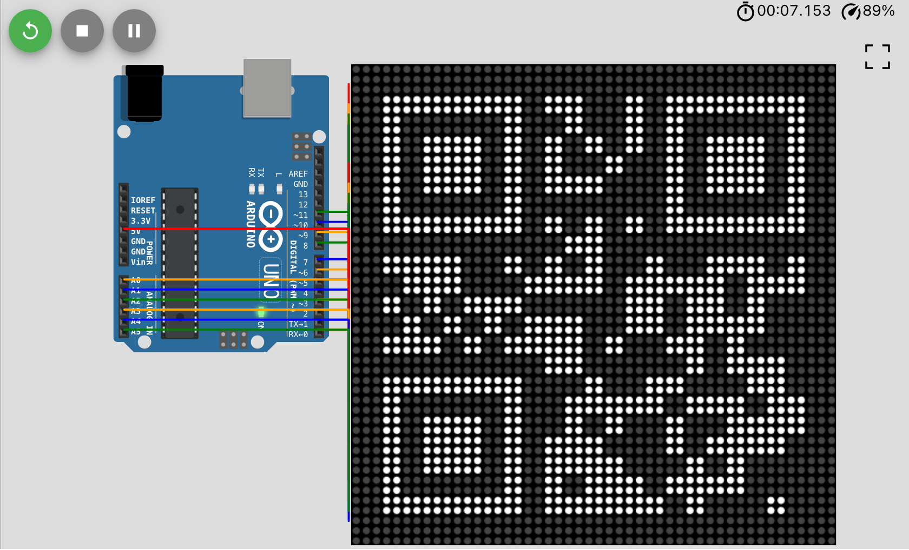

# Arduino QR Code

An Arduino QR code display using a matrix of 8×8 LED dot matrix displays driven
by the MAX7219 display driver.

[8×8 LED dot matrix displays AliExpress](https://www.aliexpress.com/item/32849877252.html)

The displays are chainable up to 8 displays in one chain. Multiple chains need
to be used to drive more displays.

Arduino has 14 digital pins and 6 analog pins which can be used as digital. It
can support up to 6 chains (3 SPI pins per chain: DIN, CLK and CS). That results
in the maximum display size of 48×48 dots (6×6 displays to keep the QR square).
This allows displaying QR codes of versions 1-7 or displaying a version 1 code
at twice the size.

| Version  | Pixels       | Displays | Dots         | Utilization      |
|----------|--------------|----------|--------------|------------------|
| QR 1     | 21×21 (441)  | 9 (3×3)  | 24×24 (576)  | 77 % (441/576)   |
| QR 1 @2x | 42×42 (1764) | 36 (6×6) | 48×48 (2304) | 76 % (1764/2304) |
| QR 2     | 25×25 (625)  | 16 (4×4) | 32×32 (1024) | 61 % (625/1024)  |
| QR 3     | 29×29 (841)  | 16 (4×4) | 32×32 (1024) | 82 % (841/1024)  |
| QR 4     | 33×33 (1089) | 25 (5×5) | 40×40 (1600) | 68 % (1089/1600) |
| QR 5     | 37×37 (1369) | 25 (5×5) | 40×40 (1600) | 85 % (1369/1600) |
| QR 6     | 41×41 (1681) | 36 (6×6) | 48×48 (2304) | 72 % (1681/2304) |
| QR 7     | 45×45 (2025) | 36 (6×6) | 48×48 (2304) | 87 % (2025/2304) |

[QR Code Storage (Wikipedia)](https://en.wikipedia.org/wiki/QR_code#Storage)

| QR | NH  | NQ  | NM  | NL  | ANH | ANQ | ANM | ANL |
|----|-----|-----|-----|-----|-----|-----|-----|-----|
| 1  | 17  | 27  | 34  | 41  | 10  | 16  | 20  | 25  |
| 2  | 34  | 48  | 63  | 77  | 20  | 29  | 38  | 47  |
| 3  | 58  | 77  | 101 | 127 | 35  | 47  | 61  | 77  |
| 4  | 82  | 111 | 149 | 187 | 50  | 67  | 90  | 114 |
| 5  | 106 | 144 | 202 | 255 | 64  | 87  | 122 | 154 |
| 6  | 139 | 178 | 255 | 322 | 84  | 108 | 154 | 195 |
| 7  | 154 | 207 | 293 | 370 | 93  | 125 | 178 | 224 |

| QR  | 1  | 2  | 3   | 4   | 5   | 6   | 7   |
|-----|----|----|-----|-----|-----|-----|-----|
| NH  | 17 | 34 | 58  | 82  | 106 | 139 | 154 |
| NQ  | 27 | 48 | 77  | 111 | 144 | 178 | 207 |
| NM  | 34 | 63 | 101 | 149 | 202 | 255 | 293 |
| NL  | 41 | 77 | 127 | 187 | 255 | 322 | 370 |
| ANH | 10 | 20 | 35  | 50  | 64  | 84  | 93  |
| ANQ | 16 | 29 | 47  | 67  | 87  | 108 | 125 |
| ANM | 20 | 38 | 61  | 90  | 122 | 154 | 178 |
| ANL | 25 | 47 | 77  | 114 | 154 | 195 | 224 |

N = numeric, AN = alpha-numeric, H = high, Q = quartile, M = medium, L = low

[Information Capacity (QRCode.com)](https://www.qrcode.com/en/about/version.html)

## Code

See [`qr.ino`](qr.ino) for the WIP live Arduino code. Compared to the simulation
below, it adds Bluetooth communication support and uses correct wiring to how
the LED dot matrix displays I got behave, they seem to differ a bit from the
simulated ones.

## [Wokwi Simulation](https://wokwi.com/arduino/projects/297148152803230218)

See [`wokwi.ino`](wokwi.ino) and [`diagram.json`](diagram.json) for the Wokwi
simulation files. Compared to the live Arduino code above, there is no Bluetooth
communication support.

## To-Do

### Document my build of the 3×3 display grid

I build a 3×3 display grid and wired it up to an Arduino Uno. The wiring was a
bit different from the Wokwi simulation.

- [ ] Include the real hardware wiring diagram
- [ ] Add photos+videos of the QR code in action including scanning screencast
- [ ] Document the HC-06 and HM-10 (MLT-BT05) difference (not BLE versus BLE)
  - iOS seems to only support BLE (maybe BT 4.0) based Bluetooth serial modules
  - Android supports only non-BLE with my Samsung A41 test phone and the app
    [Arduino bluetooth controller](https://play.google.com/store/apps/details?id=com.giumig.apps.bluetoothserialmonitor)
- [ ] Document https://www.arduino.cc/en/Reference/SoftwareSerial serial bridge
  - Echo Bluetooth serial to serial data to debug in Arduino IDE Serial Monitor
  - Echo serial to Bluetooth serial data to debug in BLExAR iOS app Console
- [ ] Document [pins](https://forum.arduino.cc/t/hc-06-and-serial-available-always-0/237404/2)

#### [Web-Bluetooth-Terminal](https://loginov-rocks.github.io/Web-Bluetooth-Terminal)

[Danila Loginov](https://github.com/loginov-rocks) built a WebBluetooth terminal
capable of talking to the HM-10/MLT-BT05 BLE module. It works for me in Chrome
on macOS and using [Bluefy] on iOS.

[Bluefy]: https://apps.apple.com/us/app/bluefy-web-ble-browser/id1492822055

It doesn't work with the HC-06 Bluetooth 2.0/3.0 module. It seems WebBluetooth
only supports Bluetooth 4.0/BLE since macOS itself did see both modules.

[Source (GitHub)](https://github.com/loginov-rocks/Web-Bluetooth-Terminal)

### 3D-print an enclosure to hold the 4×4 matrix of the displays together

### Experiment with normal and inverted QR display to see what reads better

### Await and try white dot-matrix displays to see if they scan better than red

I ordered a bunch of white dot matrix displays to see if they scan faster/more
reliably.

### See if I can make this work on the Raspberry Pi Pico using Wokwi Pico sim

The Pico can mount itself as a mass storage device, so the text file QR content
source idea would be that much easier.

### Verify LEDControl can truly only drive 8 dot matrix displays in a chain

Test this on actual hardware. Check other libraries too, to find whichever is
able to control the most displays.

### Test the method of using analog pins as digital on a real Arduino

[According to Stack Overflow](https://arduino.stackexchange.com/q/117/23747) and
the Wokwi simulation above, analog pins can be used as digital pins. If on real
hardware this works, it bumps us from a 4×4 display to a 6×6 display.

### Await EZ Expander delivery and try out layouts with more chains than 6

[EZ Expander (NootropicDesign.com)](https://nootropicdesign.com/ez-expander)

I've ordered 3 and they should arrive in a week or two.

14 digital pins - 3 used shield pins + 13 new shield pins + 6 analog pins = 30

30 pins ~ 10 chains.

If the chains are truly stuck at 8 displays at most, this would give us a 8×8
display, 64×64 dots, QR level up to 11 (61×61). Or QR version 3 at double size.
Version 11 numeric capacity is 331-772 and alphanumeric 200-468.

If the chains could somehow be 10 displays long, that would give us a 10×10
display, 100×100 dots, QR level up to 20 (97×97). Or QR version 7, double sized.
Version 20 numeric capacity is 919-2061 and alphanumeric 557-1249.

If the chains really need to be at most 8 displays, we could still achieve a 9×9
display by using 8 chains for an 8×8 display and then two chains for the 9th row
and column. This would complicate the code calculations, but could be worth it.
9×9 is 72×72 dots, QR level up to version 13 (69×69). Or QR version 4, doubled.
Version 13 numeric capacity is 427-1022 and alphanumeric 259-619.

### Address code `TODO` comments

There are some improvement / new feature ideas in there.

### Build a PCB to mount the LED dot matrix display grid and the Arduino on

Instead of attempting to squeeze the rat's nest of wires into the 3d printed box
or to use solder bridge connections between the displays to avoid the excessive
amount of wires, let's order a PCB where the driver boards could be mounted such
that the display grid works out perfectly aligned and the Arduino could be held
on the backside of the PCB, or even on the front side too in sort of a base.

Consider whether I want to have an on-board battery and a switch or if I'll just
run a USB cable out from the enclosure to connect into a powerbank.

### Calculate approximate expected runtime on a battery

The load of this device is basically constant, so it should be doable to find an
approximate duration I can expect this to last… and then verify it in the real
world.

### Trim the received message and further validate it if needed

At the very least, leading and trailing space could be removed. Perhaps length
and fit into the QR code storage for the given level could be checked, too. The
indication of an incorrect value could be the display grid going blank or
blinking.

### Print the processed message back into the Bluetooth serial console

To confirm the payload was set and how it was adjusted (trim, case).

### Figure out why the mismatch with QR generator library (libraries?)

I found this QR generator online which allows controlling the level, too:

https://www.nayuki.io/page/qr-code-generator-library

My QR codes scan, but they appear different from the ones generated by this lib.
I should find out why that is to understand if I have any problems in my QR code
setup.

### Play around with the `wokwi-logic-analyzer` part to see the display driving

This is an undocumented part in Wokwi. It should be fun to hook it up to a
single display and see the driving signals for things like lighting up the edge
LEDs and clearing/filling the display. Maybe it will also reveal the difference
between pushing in a single row/column as a single number/call in LEDControl and
setting the individual LEDs. The output format of the logic analyzer is VCD,
openable by PulseView (Open > Import Value Change Dump data).

### Test whether using `setRow`/`setColumn` would be faster than `setLed`

The complexity of the code would increase if I were to use either of these
methods, but if the performance improves, it might be justifiable. Although the
current "rolling" animation is pretty pleasant to look at, so maybe fast refresh
is not needed?
