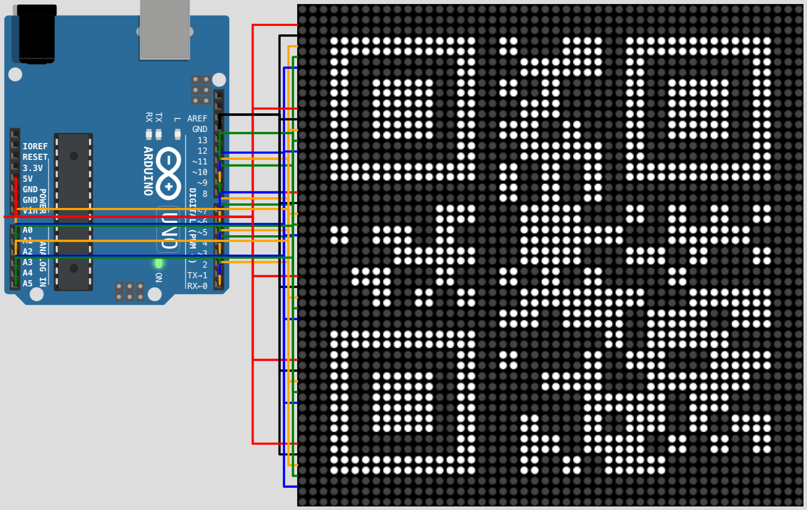

# Arduino QR Code

An Arduino QR code display using a 4×4 matrix of 8×8 LED matrix displays using
the MAX7219 display driver. [AliExpress](https://www.aliexpress.com/item/32849877252.html)



The displays are chainable up to 8 displays in one chain. Multiple chains need
to be used to drive more displays. Arduino with 13 digital pins can support up
to 4 chains (3 SPI pins per chain: DIN, CLK and CS). That gives us the maximum
display size of 32×32 dots (4×4 displays to keep the compound display square).
This allows displaying QR codes of versions 1, 2 and 3:

[Wikipedia: QR Code Storage](https://en.wikipedia.org/wiki/QR_code#Storage):

| QR Version | QR Size | 8×8 LED Matrix Display Count | Utilization           |
|------------|---------|------------------------------|-----------------------|
| 1          | 21×21   | 9 (3×3 - 24×24)              | 77 % (441/576 dots)   |
| 2          | 25×25   | 16 (4×4 - 32×32)             | 61 % (625/1024 dots)  |
| 3          | 29×29   | 16 (4×4 - 32×32)             | 82 % (841/1024 dots)  |

## [Wokwi Simulation](https://wokwi.com/arduino/projects/297148152803230218)

`qrcode.ino`
```ino
#include <LedControl.h>
#include "qrcode.h"

LedControl ledControl0 = LedControl(/* DIN */ 0, /* CLK */ 1, /* CS */ 2, /* Count */ 4);
LedControl ledControl1 = LedControl(/* DIN */ 3, /* CLK */ 4, /* CS */ 5, /* Count */ 4);
LedControl ledControl2 = LedControl(/* DIN */ 6, /* CLK */ 7, /* CS */ 8, /* Count */ 4);
LedControl ledControl3 = LedControl(/* DIN */ 9, /* CLK */ 10, /* CS */ 11, /* Count */ 4);
QRCode qrcode;

void setup() {
  ledControl0.setIntensity(0, 15);

  // Allocate array large enough to hold a version 3 QR code (29*29)
  uint8_t qrcodeData[qrcode_getBufferSize(3)];
  qrcode_initText(&qrcode, qrcodeData, 3, 0, "HELLO WORLD");

  drawQrCode();
  //drawPixel(31, 15);
}

void loop() {
  // TODO: Replace this with ArduinoLowPower.h and its power-down mode:
  // LowPower.powerDown(SLEEP_8S, ADC_OFF, BOD_OFF);
  delay(2147483647);
}

void drawPixel(int x, int y) {
  for (int index = 0; index < 2; index++) {
    LedControl ledControl = index == 0 ? ledControl0 : ledControl1;
    if (index == y / 8) {
      ledControl.shutdown(0, false);

      ledControl.clearDisplay(0);
      ledControl.clearDisplay(1);
      ledControl.clearDisplay(2);
      ledControl.clearDisplay(3);

      int address = 3 - (x / 8);
      int row = y % 8;
      int column = 7 - (x % 8);
      ledControl.setLed(address, row, column, true);

      ledControl.shutdown(0, true);
    }
  }
}

void drawQrCode() {
  // TODO: Adjust the code for this to work and center the QR code
  int pad = (32 - qrcode.size) / 2;
  for (int y = 0; y < 32; y++) {
    for (int x = 0; x < 32; x++) {
      int address = 3 - (x / 8);
      int row = y % 8;
      int column = 7 - (x % 8);
      bool state = qrcode_getModule(&qrcode, x, y);

      // TODO: Figure out how to make `LedControl ledControl = index == 0 ? ledControl0 : ledControl1` work
      // Right now, when I do that, the displays behave very strangely
      int index = y / 8;
      switch (index) {
        case 0: {
          ledControl0.shutdown(address, false);
          ledControl0.setLed(address, row, column, state);
          ledControl0.shutdown(address, true);
          break;
        }
        case 1: {
          ledControl1.shutdown(address, false);
          ledControl1.setLed(address, row, column, state);
          ledControl1.shutdown(address, true);
          break;
        }
        case 2: {
          ledControl2.shutdown(address, false);
          ledControl2.setLed(address, row, column, state);
          ledControl2.shutdown(address, true);
          break;
        }
        case 3: {
          ledControl3.shutdown(address, false);
          ledControl3.setLed(address, row, column, state);
          ledControl3.shutdown(address, true);
          break;
        }
      }
    }
  }
}
```

`diagram.json`
```json
{
  "version": 1,
  "author": "Tomas Hubelbauer",
  "editor": "wokwi",
  "parts": [
    {
      "type": "wokwi-arduino-uno",
      "id": "uno",
      "top": 30,
      "left": 0,
      "rotate": 90,
      "hide": false,
      "attrs": {}
    },
    {
      "type": "wokwi-max7219-matrix",
      "id": "m1",
      "top": 0,
      "left": 300,
      "rotate": 0,
      "hide": false,
      "attrs": { "chain": "4" }
    },
    {
      "type": "wokwi-max7219-matrix",
      "id": "m2",
      "top": 75,
      "left": 300,
      "rotate": 0,
      "hide": false,
      "attrs": { "chain": "4" }
    },
    {
      "type": "wokwi-max7219-matrix",
      "id": "m3",
      "top": 150,
      "left": 300,
      "rotate": 0,
      "hide": false,
      "attrs": { "chain": "4" }
    },
    {
      "type": "wokwi-max7219-matrix",
      "id": "m4",
      "top": 225,
      "left": 300,
      "rotate": 0,
      "hide": false,
      "attrs": { "chain": "4" }
    }
  ],
  "connections": [
    [ "uno:GND.1", "m1:GND", "black", [ "v-12", "*", "h-16" ] ],
    [ "uno:5V", "m1:V+", "red", [ "v35", "h-10", "*", "h-40" ] ],
    [ "uno:0", "m1:DIN", "orange", [ "v-20", "*", "h-8" ] ],
    [ "uno:1", "m1:CLK", "blue", [ "v-16", "*", "h-12" ] ],
    [ "uno:2", "m1:CS", "green", [ "v-24", "*", "h-4" ] ],

    [ "uno:GND.1", "m2:GND", "black", [ "v-12", "*", "h-16" ] ],
    [ "uno:5V", "m2:V+", "red", [ "v35", "h-10", "*", "h-40" ] ],
    [ "uno:3", "m2:DIN", "orange", [ "v-20", "*", "h-8" ] ],
    [ "uno:4", "m2:CLK", "blue", [ "v-16", "*", "h-12" ] ],
    [ "uno:5", "m2:CS", "green", [ "v-24", "*", "h-4" ] ],

    [ "uno:GND.1", "m3:GND", "black", [ "v-12", "*", "h-16" ] ],
    [ "uno:5V", "m3:V+", "red", [ "v35", "h-10", "*", "h-40" ] ],
    [ "uno:6", "m3:DIN", "orange", [ "v-20", "*", "h-8" ] ],
    [ "uno:7", "m3:CLK", "blue", [ "v-16", "*", "h-12" ] ],
    [ "uno:8", "m3:CS", "green", [ "v-24", "*", "h-4" ] ],

    [ "uno:GND.1", "m4:GND", "black", [ "v-12", "*", "h-16" ] ],
    [ "uno:5V", "m4:V+", "red", [ "v35", "h-10", "*", "h-40" ] ],
    [ "uno:9", "m4:DIN", "orange", [ "v-20", "*", "h-8" ] ],
    [ "uno:10", "m4:CLK", "blue", [ "v-16", "*", "h-12" ] ],
    [ "uno:11", "m4:CS", "green", [ "v-24", "*", "h-4" ] ]
  ]
}
```

`qrcode.c` and `qrcode.h` from [ricmoo/QRCode](https://github.com/ricmoo/QRCode)
also need to be added to the project.

[LEDControl](https://www.arduino.cc/reference/en/libraries/ledcontrol) will work
out of the box.

[LEDControl documentation](http://wayoda.github.io/LedControl/pages/software)

## To-Do

### Wire up the Wokwi simulation using a real Arduino and MAX7219 display grid

### 3D-print an enclosure to hold the 4×4 matrix of the displays together
